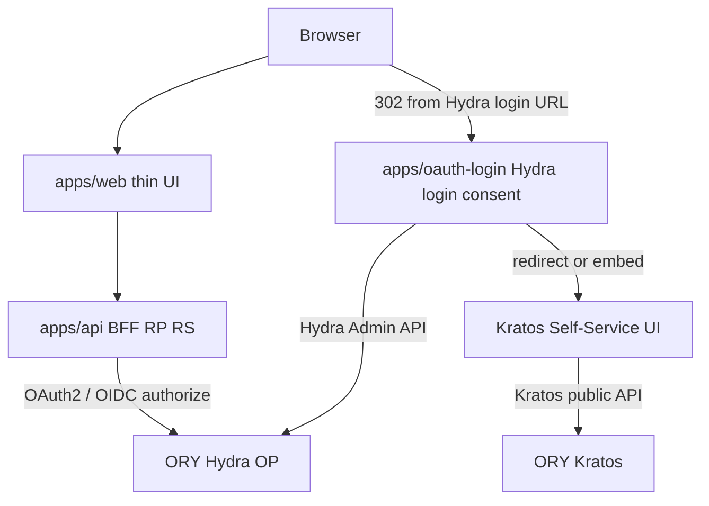
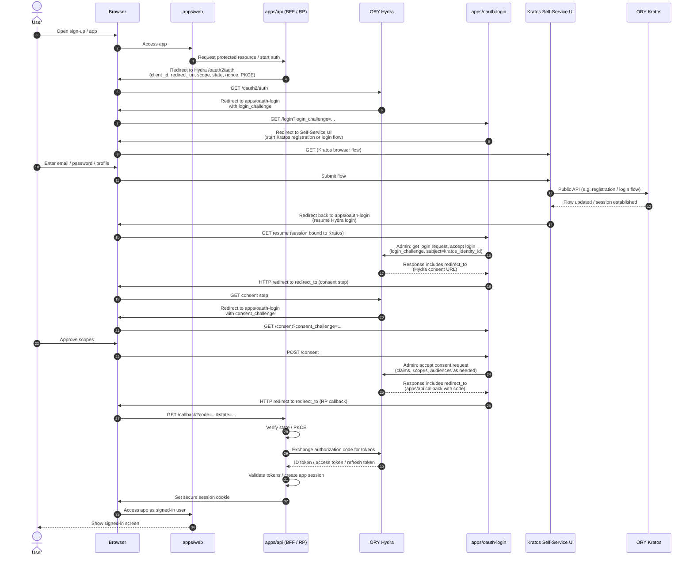

# auth-playground

IAM-style authentication and authorization experiments for production-like SaaS identity stacks.

This README describes the **intended architecture and behavior** as the repository grows; treat it as the design reference for components and flows below.

## Overview

- OIDC
- OAuth 2.0 Authorization Code + PKCE
- [OAuth 2.0 Token Exchange](https://www.rfc-editor.org/rfc/rfc8693) (RFC 8693) at Hydra’s token endpoint—exchange tokens for downstream audiences, delegation, or token shape (distinct from authorization-code refresh)
- OAuth 2.0 client credentials (`client_credentials` grant) for outbound machine-to-machine calls from `apps/api` when no end user is in scope
- Token validation and authorization
- Multi-tenant APIs
- RBAC / ABAC / ReBAC
- Token lifecycle

## Local development

```bash
make up        # start the OIDC stack (Hydra, Kratos, Postgres, SSUI, Mailslurper)
make test      # run the SIGNUP-NN suite in apps/api
make help      # everything else
```

`make` with no target prints the same listing. See [`docs/specs/`](./docs/specs) for the design contract the code is expected to satisfy.

## Architecture

### Monorepo

- Turborepo, pnpm

### Kratos terminology

Short glossary for words used elsewhere in this README when **ORY Kratos** is the identity tier. For full definitions, see [ORY Kratos](https://www.ory.sh/docs/kratos).

| Term | Meaning here |
| ------ | ------ |
| **Identity** | A user record in Kratos (stable id, often used as Hydra **subject** when wiring login/consent). |
| **Traits** | Structured profile fields on an identity (for example email, name) defined by your Kratos identity schema—not OAuth scopes. |
| **Credentials** | How the user proves who they are to Kratos (for example password, OIDC link); stored and verified by Kratos, separate from Hydra OAuth clients. |
| **Self-service flows** | Browser-driven Kratos flows such as login, registration, recovery, verification, and settings; the official **Self-Service UI** implements these against Kratos public APIs. |

### Stack (Browser → OP)

Thin Next.js UI → Go BFF (`apps/api`, OIDC Relying Party + Resource Server) → ORY Hydra (Authorization Server / OP). End-user **authentication** and **identity records** (e.g. traits, credential identifiers) live in **ORY Kratos** and its database. **ORY Hydra** stores OAuth2/OIDC authorization-server state: clients, flows, tokens, and related AS data. For what *traits* and related Kratos words mean here, see [Kratos terminology](#kratos-terminology).

Login and consent **browser flows** use **`apps/oauth-login`** (Hydra Admin API + orchestration) and the **official Kratos Self-Service UI** (reference UI for Kratos browser flows). **`apps/api`** is the product **RP**; **`apps/oauth-login`** handles **Hydra login and consent** (challenges, Admin accept/reject, redirects).



| Layer | Role |
| ------- | ------ |
| apps/web | Thin UI: views, API calls; session cookies from `apps/api` (OIDC client lives in the BFF) |
| apps/api | **RP + BFF + Resource Server**: resolve OP metadata via **OpenID Provider Configuration** (`GET {issuer}/.well-known/openid-configuration`), then auth code flow, PKCE, state/nonce, app session, tokens, cookies, refresh, logout; **[RFC 8693](https://www.rfc-editor.org/rfc/rfc8693) token exchange** at the token endpoint for downstream-facing tokens; JWT validation from discovered **jwks_uri** (issuer/audience), optional token introspection, authz, tenant isolation. **Hydra login/consent** uses Hydra Admin from **`apps/oauth-login`**. **Acts as** a **confidential OAuth client** toward Hydra using **`client_credentials`** to obtain access tokens for **outbound** server-to-server calls (separate from browser login and separate from token exchange use cases). |
| apps/oauth-login | **Login/consent app (server)**: handles Hydra `login_challenge` / `consent_challenge`, Hydra Admin API (accept/reject), and orchestration with Kratos after a Kratos session exists. User identities live in **ORY Kratos**; the product OIDC **RP** is **`apps/api`**. |
| Kratos Self-Service UI | Official reference UI: Kratos self-service flows (login, registration, recovery, verification, settings). Runs as its **own** process (e.g. container), separate from `apps/web`. |
| ORY Kratos | Identity / credentials / flows API; persists identities (with its own database). |
| ORY Hydra | Authorization Server / OP |

Thin product UI and a Go BFF that **owns the RP session and authz**; Hydra remains the OP; Kratos remains the identity tier.

### Token endpoint grants besides browser login (`client_credentials`, RFC 8693 token exchange)

Authorization Code + PKCE covers the **interactive** product login. **`apps/api` is still expected to act as a confidential OAuth client on the same OP (Hydra)** for **non-interactive** token grants below—these are **not** optional add-ons and **must stay separate** from authorization-code / refresh tokens issued for end-user browser sessions.

`apps/api` uses Hydra’s **token endpoint** for:

- **`client_credentials`** — **required** for outbound machine-to-machine calls **without** an end user: present `client_id` / `client_secret` (or another confidential-client mechanism Hydra supports), receive an access token, use it as **Bearer** toward downstream APIs. Same issuer as interactive login, **distinct** Hydra OAuth client registration and token lifecycle from user login (see table below).

- **[RFC 8693](https://www.rfc-editor.org/rfc/rfc8693) token exchange** — exchange an issued token for another access token (different **`aud`**, **`scope`**, or shape) for downstream APIs or delegation; see [OAuth 2.0 Token Exchange (RFC 8693)](#oauth-20-token-exchange-rfc-8693).

| Mode | Purpose |
| ------ | ------ |
| Authorization Code + PKCE | End-user delegation; browser-facing RP session, cookies, user identity |
| `client_credentials` | No end user; the client’s own credentials; outbound tokens for server-to-server calls |
| [RFC 8693](https://www.rfc-editor.org/rfc/rfc8693) token exchange | Exchange an issued token at the token endpoint for another token (audience, scopes, shape)—not the same as refresh-token renewal |

**Practice:** use **separate Hydra OAuth clients** for “interactive RP”, “M2M outbound”, and token-exchange policies when that simplifies rotation and auditing. **Do not mix** user-session tokens (code/refresh flow), M2M access tokens, and tokens obtained via exchange—keep **storage, caching, audience (`aud`), and scopes** distinct so authorization stays obvious and bugs stay rare. **Client secrets** for M2M stay **only on the server** (`apps/api`), consistent with a BFF that already holds RP credentials.

### End-to-end sequence (sign-up / first login)

The graph above is static; the sequence below walks one full path: app → Hydra authorize → **`apps/oauth-login`** (Hydra challenges) → **Kratos Self-Service UI** + **Kratos** (identity) → Hydra consent → **`apps/api`** callback and tokens. Hydra Admin API responses include **`redirect_to`** URLs; **`apps/oauth-login`** issues the matching **HTTP redirects** so the browser reaches consent and then the RP callback in order.



### Repository layout (target)

```text
apps/
  web/           # Next.js: thin client (planned)
  api/           # Go: RP + BFF + RS; RFC 8693 token exchange
  oauth-login/   # Go: Hydra login/consent orchestration (planned)
docker/
  hydra/         # Hydra config
  kratos/        # Kratos config, identity schema, courier templates
  postgres/      # Postgres init script
docs/
  specs/         # Design contract: architecture, flows, cross-cutting
compose.yaml     # Local stack: Postgres, Hydra, Kratos, Self-Service UI, Mailslurper
Makefile         # Developer entry points (make help)
```

### Services

#### apps/web

- Next.js, TypeScript
- Thin client: UI, routing, API calls; session cookies from `apps/api`

#### apps/api

- Go: OIDC **RP** + BFF. **Discovery is required:** load [OpenID Provider Configuration](https://openid.net/specs/openid-connect-discovery-1_0.html) from `{issuer}/.well-known/openid-configuration` (Hydra publishes this for its issuer). Authorize, token, and JWKS usage MUST be driven from that document (full rules: **OpenID Provider Configuration (Discovery)**).
- Code flow, PKCE, state/nonce, tokens, cookies, logout
- **[RFC 8693](https://www.rfc-editor.org/rfc/rfc8693) token exchange** against Hydra’s token endpoint (subject-token / actor semantics, requested audience and scopes per deployment)—see **Technical Goals** and **OAuth 2.0 Token Exchange (RFC 8693)** below
- **Confidential OAuth client (M2M):** **`client_credentials`** against Hydra’s token endpoint for outbound access tokens—**not** optional in this design (separate Hydra client registration and token lifecycle from the interactive RP and from token-exchange flows)
- Resource Server: JWT validation using **jwks_uri** from discovery (issuer/audience), authz middleware, multi-tenant isolation
- Optional: RFC 7662 token introspection when `introspection_endpoint` is present; cache results on hot paths where latency matters

#### apps/oauth-login

- Go: **Hydra ↔ Kratos glue**: complete Hydra login and consent using Hydra Admin API after Kratos has established who the user is (`subject` aligned with Kratos identity id)
- Own deployment and secrets (Hydra Admin credentials); separate from OAuth **client** secrets used by `apps/api`

#### Kratos Self-Service UI + ORY Kratos

- Self-Service UI: official Node reference app for Kratos browser flows (configure `KRATOS_PUBLIC_URL` / UI env per ORY docs)
- Kratos: source of truth for **end-user identity**; Hydra issues OIDC/OAuth tokens for clients, and **`apps/api`** is the RP for the product

## Technical Goals

### 1. OIDC Relying Party + BFF

Mainly in `apps/api` (Go): session, token, cookie, and hardening choices for the **application** trust boundary.

#### OpenID Provider Configuration (Discovery)

This playground treats **OIDC Discovery** as part of the RP contract, not an optional convenience. `apps/api` **MUST** fetch and use `{issuer}/.well-known/openid-configuration` to obtain at least **`issuer`**, **`authorization_endpoint`**, **`token_endpoint`**, and **`jwks_uri`**. When introspection, revocation, or RP-initiated logout against Hydra are enabled, **`introspection_endpoint`**, **`revocation_endpoint`**, and **`end_session_endpoint`** MUST be resolved from the same document when advertised by Hydra; endpoint paths MUST NOT be hard-coded in parallel. Cache discovery metadata with a deliberate TTL or invalidation story so JWKS rotation and OP URL changes remain safe (see **JWKS Rotation** below).

#### Features

- OpenID Provider Configuration: fetch and cache `{issuer}/.well-known/openid-configuration`, then drive RP and RS behavior from the returned metadata
- OIDC login from BFF
- Authorization Code Flow + PKCE
- state / nonce
- Sessions and secure cookies
- Refresh tokens: use the token endpoint to renew access tokens, with **refresh-token rotation** and clear invalidation when sessions end
- **[OAuth 2.0 Token Exchange](https://www.rfc-editor.org/rfc/rfc8693) (RFC 8693):** call Hydra’s token endpoint with the token-exchange grant to obtain access tokens for downstream APIs (audience, scopes, delegation)—**not** the authorization-code refresh mechanism; refresh remains limited to renewing tokens from the interactive login session
- RP-initiated logout and session teardown

#### Security Considerations

- CSRF: state parameter
- nonce validation
- secure cookie flags
- expiry and rotation
- Token exchange: validate **`aud`**, **`scope`**, and token lifetimes for exchanged tokens; keep exchanged tokens server-side on the BFF; do not treat refresh and exchange as interchangeable grants

### 2. Resource Server (same process as BFF)

JWT validation and authz live in `apps/api` with the BFF.

#### JWT Validation

- Primary: verify JWT access tokens locally with keys from **`jwks_uri`** returned by discovery (signature, issuer, audience, expiry)
- Optional: call the OP’s token introspection endpoint (from discovery when used) for opaque access tokens or when you need AS-backed active checks; pair with caching and clear availability/latency tradeoffs

#### RBAC

Coarse **application / API** role examples for authorization checks. They are **not** the same naming scheme as the org- and tenant-shaped claim examples under [Clients, roles, and claims](#clients-roles-and-claims) (different layer; both are illustrative).

Example roles: admin, member, viewer

#### ABAC

Example attributes: tenant_id, department, resource_owner, environment

#### ReBAC

Example: an employee’s attendance approver is the head of the department the employee belongs to. Directions: ownership graph, org tree, team relationships.

### Multi-Tenant Architecture

#### Tenant Isolation

Tenant-scoped APIs, authz, roles, and claims—designed for SaaS-style isolation.

### 3. Identity and Authorization Server

#### ORY Hydra (OP)

Hydra is used for OAuth2/OIDC, login/consent customization via **your** login/consent URLs (`apps/oauth-login`), and clear AS behavior. For a given **issuer** URL, Hydra serves [OpenID Provider Configuration](https://openid.net/specs/openid-connect-discovery-1_0.html) at `{issuer}/.well-known/openid-configuration`, which is what `apps/api` uses as the source of truth for OP endpoints and `jwks_uri`. This playground expects the token endpoint to support **[RFC 8693](https://www.rfc-editor.org/rfc/rfc8693) token exchange** where enabled in Hydra (version and configuration); discovery may advertise supported grants—align `apps/api` with that metadata.

#### ORY Kratos (identity)

Kratos holds **who the user is** for authentication flows; integrate with Hydra by completing login/consent in `apps/oauth-login` using a stable **subject** (e.g. Kratos identity id). For **identity / traits / credentials / self-service** wording, see [Kratos terminology](#kratos-terminology) under Architecture.

#### Clients, roles, and claims

Examples at the **OAuth client and token-claim** layer (org, tenant, support). Use them to think about Hydra clients and what lands in access-token claims—not as the only RBAC vocabulary for application code.

- Clients: public, confidential, M2M (examples)
- Roles: org_admin, tenant_admin, member, support_operator
- Custom claims (example):

```json
{
  "tenant_id": "tenant-a",
  "org_role": "admin",
  "permissions": [
    "document:read",
    "document:write"
  ]
}
```

## Advanced Topics

### OAuth 2.0 Token Exchange (RFC 8693)

The BFF uses Hydra’s **token endpoint** with the **`urn:ietf:params:oauth:grant-type:token-exchange`** grant to turn tokens already issued by Hydra (for example the interactive flow’s access token, or a refresh token where Hydra allows it) into **new access tokens** suited to another API—typically different **`aud`**, **`scope`**, or shape. That supports delegation and calling downstream services without exposing the browser session’s tokens to those services.

**Refresh** (authorization-code grant + refresh token) renews access for the **same** interactive session at the RP; **token exchange** produces tokens for **another** consumption context. Keep grants, storage, and caching policies separate.

Operational notes: enforce least privilege on requested scopes and audiences; cache exchanged tokens only where latency requires it and TTL matches risk; confirm Hydra’s supported token types and policies for subject vs actor tokens for your deployment.

### Token roles across BFF, browser, and API

- Use the ID token (and OIDC claims) where you establish **who** signed in; use the access token where you decide **what** the caller may do on APIs—keep the two token roles distinct.
- Align **aud** (and validation rules) with each recipient: what the browser or BFF may see vs what the resource server accepts.
- When a BFF holds the session, keep access tokens on the server; the browser and the API are different trust zones.
- Tokens obtained via RFC 8693 exchange should be treated like other confidential server-side tokens: validate at downstream APIs and avoid forwarding them to the browser unless a product requirement explicitly calls for it.

### JWKS Rotation

- Rotation, cache invalidation, graceful rollover, continuous verification

### Token Revocation

- Short-lived access tokens, refresh rotation, revocation patterns, session invalidation

### Authorization Architecture

- RBAC limits, ABAC tradeoffs, ReBAC for collaborative SaaS, evolving policies

## Future Enhancements

- Session rotation, refresh policy, audit logging, scoped admin impersonation
- Deeper RBAC/ABAC/ReBAC; policy engines (OpenFGA, OPA)
- SCIM, org hierarchy, passkeys/WebAuthn, device flow
- Distributed sessions, event-driven authz updates

## References

- [OpenID Connect Core 1.0](https://openid.net/specs/openid-connect-core-1_0.html)
- [OpenID Connect Discovery 1.0](https://openid.net/specs/openid-connect-discovery-1_0.html)
- [OAuth 2.0](https://www.rfc-editor.org/rfc/rfc6749) (RFC 6749); [OAuth 2.0 Token Exchange](https://www.rfc-editor.org/rfc/rfc8693) (RFC 8693); [OAuth 2.0 Security Best Current Practice](https://www.rfc-editor.org/rfc/rfc9700) (RFC 9700)
- [ORY Hydra](https://www.ory.sh/docs/hydra) · [ORY Kratos](https://www.ory.sh/docs/kratos)

## Playground Focus

This playground **prioritizes** backend, platform, and security over visual UI polish. **`apps/web`** stays a **thin client** on purpose: product routing and presentation can evolve later without changing the trust boundaries in this document.

The story is a **strictly separated** stack: **`apps/api` as the OIDC RP** (sessions, tokens, cookies, authz for the product), implementing **[RFC 8693](https://www.rfc-editor.org/rfc/rfc8693) token exchange** toward Hydra for downstream-facing tokens, and as a **confidential OAuth client** using **`client_credentials`** for outbound M2M tokens (same OP, distinct from user-login tokens); **`apps/oauth-login` for Hydra login/consent completion**; **Kratos + official Self-Service UI for identity**; and **Hydra as the OP**—aimed at backend, architecture, authz, multi-tenant, and distributed-systems work.
