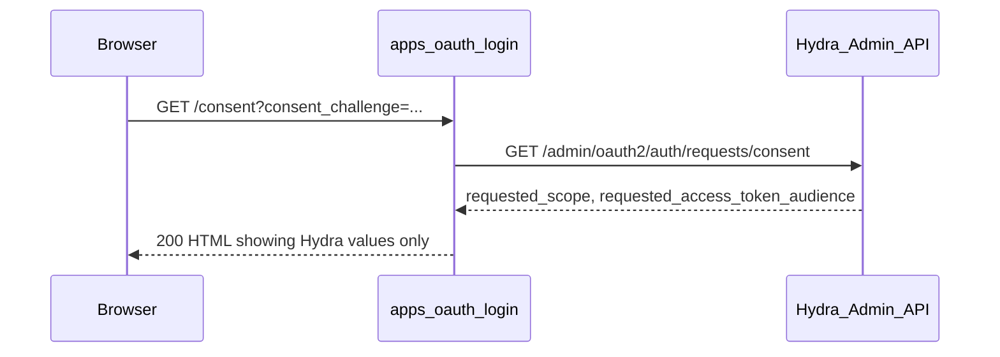

# Plan: SIGNUP-08 — Consent page shows Hydra-supplied scope only

Status: Draft
Last updated: 2026-05-27 (revised after review)
Requirement: [SIGNUP-08](../specs/10-flows/signup-first-login.md#signup-08)

## Checklist

- [ ] Add `ConsentRequest` struct and `GetConsentRequest` to [`apps/oauth-login/hydra/hydra.go`](../../apps/oauth-login/hydra/hydra.go)
- [ ] Create [`apps/oauth-login/consent/consent.go`](../../apps/oauth-login/consent/consent.go) with GET handler that renders Hydra scope/audience only
- [ ] Register `GET /consent` in [`apps/oauth-login/internal/server/server.go`](../../apps/oauth-login/internal/server/server.go)
- [ ] Replace SIGNUP-08 `pending()` stub in [`apps/api/internal/signup/signup_test.go`](../../apps/api/internal/signup/signup_test.go) with hermetic subtests mirroring SIGNUP-05
- [ ] Run `make test-signup` and confirm SIGNUP-08 passes without regressions

## Requirement

From [signup-first-login.md#signup-08](../specs/10-flows/signup-first-login.md#signup-08):

> On `GET /consent?consent_challenge=...`, `apps/oauth-login` **MUST** resolve the challenge via Hydra Admin. The `requested_scope` and `requested_audience` shown to the user **MUST** be the values Hydra returned; `apps/oauth-login` **MUST NOT** silently widen them.

Related acceptance criterion (partially exercised here): the browser must not receive raw Hydra Admin JSON — only user-facing HTML and, later on POST, a `redirect_to` redirect ([signup-first-login.md](../specs/10-flows/signup-first-login.md) line 147).

## Current state

| Area | Status |
|------|--------|
| Login flow (SIGNUP-05..07) | Implemented in [`apps/oauth-login/login/login.go`](../../apps/oauth-login/login/login.go) |
| Hydra Admin client | Login only: `GetLoginRequest`, `AcceptLoginRequest` in [`apps/oauth-login/hydra/hydra.go`](../../apps/oauth-login/hydra/hydra.go) |
| Consent routes | **Missing** — [`apps/oauth-login/internal/server/server.go`](../../apps/oauth-login/internal/server/server.go) registers only `/login` and `/login/resume` |
| Hydra config | Already points consent URL to `http://127.0.0.1:3000/consent` ([`docker/hydra/hydra.yml`](../../docker/hydra/hydra.yml)) |
| Test | [`TestSignup_SIGNUP_08_ConsentShowsHydraSuppliedScopeOnly`](../../apps/api/internal/signup/signup_test.go) is a `pending()` stub |



## Scope boundary

**In scope (SIGNUP-08):** GET handler, Hydra consent GET client, HTML render, hermetic test.

**Out of scope (SIGNUP-09):** `POST /consent`, `AcceptConsentRequest`, claim population (`tenant_id`), anti-widening on accept body. The consent page may include a stub Approve form pointing at `POST /consent`, but the POST handler itself belongs to the next requirement.

**Deferred:** Hydra `skip: true` auto-accept path (RETURN-07 remembered consent). SIGNUP-08 tests assume `skip: false` and a rendered page.

## Implementation

### 1. Extend Hydra Admin client

File: [`apps/oauth-login/hydra/hydra.go`](../../apps/oauth-login/hydra/hydra.go)

Add a `ConsentRequest` struct mirroring the login struct fields needed for display:

```go
// ConsentRequest holds the fields needed to render the consent page.
// RequestURL is intentionally omitted (present in LoginRequest) — the browser
// must not see raw Admin fields. Skip is included for completeness; SIGNUP-08
// always renders the page regardless of its value (skip: true auto-accept is
// deferred to RETURN-07).
type ConsentRequest struct {
    Challenge                    string   `json:"challenge"`
    RequestedScope               []string `json:"requested_scope"`
    RequestedAccessTokenAudience []string `json:"requested_access_token_audience"`
    Skip                         bool     `json:"skip"`
    Subject                      string   `json:"subject"`
}
```

Add `GetConsentRequest(ctx, challengeID)` calling:

`GET {adminURL}/admin/oauth2/auth/requests/consent?consent_challenge={challengeID}`

Follow the same error-handling and JSON decode pattern as `GetLoginRequest`. Map spec term `requested_audience` to Hydra's JSON field `requested_access_token_audience` (same as login requests).

### 2. Add consent GET handler

New file: [`apps/oauth-login/consent/consent.go`](../../apps/oauth-login/consent/consent.go)

Mirror the SIGNUP-05 structure from [`login/login.go`](../../apps/oauth-login/login/login.go):

```go
type Handler struct {
    HydraAdmin *hydra.Client
}

func (h *Handler) ServeHTTP(w http.ResponseWriter, r *http.Request) {
    challengeID := r.URL.Query().Get("consent_challenge")
    // 400 if missing
    consent, err := h.HydraAdmin.GetConsentRequest(r.Context(), challengeID)
    // 502 on Hydra error
    renderConsentPage(w, consent) // scopes/audience from consent only
}
```

Rendering rules (these satisfy SIGNUP-08):

- **Trust only `consent_challenge`** from the query string; ignore `scope`, `requested_scope`, `audience`, `subject`, etc.
- **Display exactly** `consent.RequestedScope` and `consent.RequestedAccessTokenAudience` — no merging with config defaults, client registration, or query params. Render both slices unconditionally; an empty `RequestedAccessTokenAudience` produces an empty `<ul>`.
- **Do not expose** raw Admin fields (`request_url`, `client` object, full JSON). Render a minimal HTML page (inline `html/template` or `fmt.Fprintf` — no templates exist in the repo yet).
- **No hidden scope inputs** in the form; if an Approve button is included, pass only `consent_challenge` (POST handling deferred to SIGNUP-09).
- **`skip: true`** is not acted upon in SIGNUP-08 — render the page regardless. Auto-accept is deferred to RETURN-07.

Suggested HTML shape (minimal, test-friendly):

```html
<h1>Consent</h1>
<ul data-testid="requested-scope">…</ul>
<ul data-testid="requested-audience">…</ul>
<form method="POST" action="/consent">
  <input type="hidden" name="consent_challenge" value="…">
  <button type="submit">Approve</button>
</form>
```

Use `data-testid` attributes so tests can assert displayed values without brittle full-body string matching.

### 3. Wire route

File: [`apps/oauth-login/internal/server/server.go`](../../apps/oauth-login/internal/server/server.go)

Extract a single `hydraAdmin` client variable and pass it to both handlers so login and consent share one instance:

```go
hydraAdmin := hydra.NewClient(deps.Cfg.HydraAdminURL, http.DefaultClient)
loginHandler := &login.Handler{
    HydraAdmin:        hydraAdmin,
    KratosPublic:      kratos.NewClient(deps.Cfg.KratosPublicURL, http.DefaultClient),
    OAuthLoginBaseURL: deps.Cfg.OAuthLoginBaseURL,
}
mux.Handle("GET /login", loginHandler)
mux.Handle("GET /login/resume", &login.ResumeHandler{Handler: *loginHandler})

consentHandler := &consent.Handler{HydraAdmin: hydraAdmin}
mux.Handle("GET /consent", consentHandler)
```

> **Note:** `go.work` does not need updating. `consent` is a new package inside the existing `apps/oauth-login` module, so no workspace-level changes are required.

### 4. Implement hermetic test

File: [`apps/api/internal/signup/signup_test.go`](../../apps/api/internal/signup/signup_test.go)

Add `t.Parallel()` at the top of `TestSignup_SIGNUP_08_ConsentShowsHydraSuppliedScopeOnly` (consistent with all other implemented SIGNUP tests), then replace the `pending()` call with subtests modeled on `TestSignup_SIGNUP_05_ResolveLoginChallengeViaHydraAdmin` (lines 577–674):

| Subtest | Assertion |
|---------|-----------|
| `calls Hydra Admin with exact challenge ID` | Stub receives `consent_challenge`; handler returns 200 |
| `ignores query params beyond consent_challenge` | Request includes `&scope=admin&requested_scope=evil`; Hydra still called with exact challenge only |
| `missing consent_challenge returns 400` | Hydra Admin not called |
| `shows Hydra-requested scope and audience only` | Hydra stub returns `["openid","profile"]` and `["api://resource"]`; body contains those strings; body does **not** contain the injected `"admin"` or `"evil"` values |
| `does not leak Hydra Admin response fields` | Body does not contain `"request_url"` or JSON key patterns like `"challenge":` (colon-suffix form, to avoid false positives from `consent_challenge` appearing in the HTML form) |

Hydra stub endpoint: `GET /admin/oauth2/auth/requests/consent`.

The shared stub defined at the top of the test should return the display fixture used by the "shows scope" and "does not leak" subtests (`["openid","profile"]` / `["api://resource"]`); the "calls" and "ignores extra params" subtests verify only the challenge forwarding and can tolerate any valid stub response.

Import the new package: `github.com/jp-ryuji/auth-playground/apps/oauth-login/consent`.

### 5. Verification

```bash
make test-signup
# or targeted:
cd apps/api && go test -v -run TestSignup_SIGNUP_08 ./internal/signup/...
```

All existing SIGNUP tests must remain green.

## Files touched

| File | Change |
|------|--------|
| [`apps/oauth-login/hydra/hydra.go`](../../apps/oauth-login/hydra/hydra.go) | Add `ConsentRequest`, `GetConsentRequest` |
| [`apps/oauth-login/consent/consent.go`](../../apps/oauth-login/consent/consent.go) | **New** — GET handler + HTML render |
| [`apps/oauth-login/internal/server/server.go`](../../apps/oauth-login/internal/server/server.go) | Register `GET /consent` |
| [`apps/api/internal/signup/signup_test.go`](../../apps/api/internal/signup/signup_test.go) | Replace SIGNUP-08 stub with real assertions |

## Follow-ups (not this PR)

- **SIGNUP-09:** `POST /consent`, `AcceptConsentRequest`, server-sourced claims, accept-body anti-widening
- **Acceptance LEAK test:** broader check that POST redirect exposes only `redirect_to` (composes SIGNUP-05 + SIGNUP-08)
- **Spec promotion:** `signup-first-login.md` stays Draft until all SIGNUP-01..14 are green
