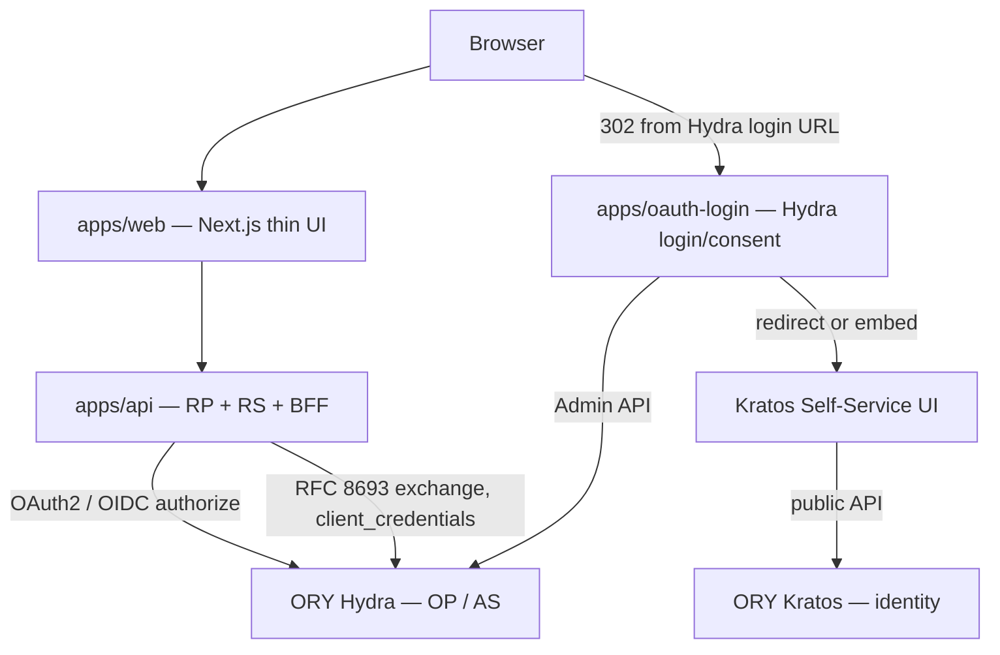

# System Overview

Status: Draft
Last updated: 2026-05-12
Scope: components, trust boundaries, and the cross-cutting rules every other spec depends on.

References:
- [OpenID Connect Core 1.0](https://openid.net/specs/openid-connect-core-1_0.html)
- [OpenID Connect Discovery 1.0](https://openid.net/specs/openid-connect-discovery-1_0.html)
- [RFC 6749](https://www.rfc-editor.org/rfc/rfc6749) — OAuth 2.0
- [RFC 8693](https://www.rfc-editor.org/rfc/rfc8693) — OAuth 2.0 Token Exchange
- [RFC 9700](https://www.rfc-editor.org/rfc/rfc9700) — OAuth 2.0 Security BCP
- [ORY Hydra](https://www.ory.sh/docs/hydra), [ORY Kratos](https://www.ory.sh/docs/kratos)
- Repo [README.md](../../../README.md), spec [glossary.md](../glossary.md)

## Purpose

Define the system as a set of services, the trust boundaries between them, and the small number of cross-cutting rules that flow specs and service specs MUST honour. Most of this section is prose; the normative bits are concentrated under [Requirements](#requirements).

## Components

Component roles, summarized — each gets a full spec under `20-services/`:

- **`apps/web`** — thin UI. No OAuth state, no tokens. Holds only an opaque session cookie minted by `apps/api`.
- **`apps/api`** — product RP + RS + BFF; also a confidential OAuth client for M2M and RFC 8693 exchange. Holds the user session, refresh tokens, and downstream-call tokens server-side.
- **`apps/oauth-login`** — Hydra login/consent orchestrator. Owns Hydra Admin credentials. Stateless with respect to the user's product session.
- **Kratos Self-Service UI** — ORY's reference Node UI for Kratos browser flows. Separate process; not part of `apps/web`.
- **ORY Hydra** — OP / AS. Stores OAuth clients and AS state.
- **ORY Kratos** — identity store. Stores identities, traits, credentials.

## Trust boundaries

| Boundary | What crosses | Notes |
| -------- | ------------ | ----- |
| Browser ↔ `apps/web` | HTML, fetch JSON | No OAuth tokens. |
| Browser ↔ `apps/api` | Session cookie | HttpOnly, Secure, SameSite. Opaque value; not a JWT. |
| Browser ↔ `apps/oauth-login` | login/consent redirects with `*_challenge` query params | Browser only sees challenge ids, never Hydra Admin responses. |
| Browser ↔ Kratos Self-Service UI / Kratos public API | Kratos flow ids, form submissions | Kratos session cookie is set by Kratos, scoped to its domain. |
| `apps/api` ↔ Hydra | OAuth client credentials, token-endpoint calls, JWKS fetch | Confidential. `apps/api` MUST have a separate Hydra OAuth client per use case (see [OV-04](#ov-04)). |
| `apps/oauth-login` ↔ Hydra Admin API | login/consent accept/reject | Privileged. Distinct credential set from any OAuth client credentials used by `apps/api`. |

## Requirements

### Discovery is the source of truth

- **OV-01.** `apps/api` **MUST** load `{issuer}/.well-known/openid-configuration` at startup and use it as the sole source for `authorization_endpoint`, `token_endpoint`, and `jwks_uri`. Endpoint paths **MUST NOT** be hard-coded in parallel.
- **OV-02.** When `apps/api` uses introspection, revocation, or RP-initiated logout, it **MUST** read `introspection_endpoint`, `revocation_endpoint`, and `end_session_endpoint` from the discovery document. If a needed endpoint is not advertised by Hydra, the feature **MUST** be disabled at startup or the service **MUST** refuse to start with a clear error.
- **OV-03.** Discovery metadata **SHOULD** be cached with a deliberate TTL or explicit invalidation hook; JWKS fetched from `jwks_uri` **MUST** support rotation without a service restart (full rules in `30-cross-cutting/discovery-and-jwks.md`, to be written).

### Three-grant separation (load-bearing)

- **OV-04.** `apps/api` **MUST** use a distinct Hydra OAuth client registration for each of: interactive RP login (Authorization Code + PKCE), outbound M2M (`client_credentials`), and RFC 8693 token exchange. Mixing these onto one client registration is **NOT** permitted.
- **OV-05.** Tokens obtained via the three grants **MUST NOT** share storage, cache, or in-process state. User-session tokens, M2M access tokens, and exchanged tokens live in separate stores keyed by purpose.
- **OV-06.** Each grant **MUST** target a distinct `aud`. Resource servers downstream of `apps/api` **MUST** validate `aud` against their own identifier and reject tokens whose `aud` does not match, regardless of issuer.
- **OV-07.** Refresh tokens (authorization-code grant) and RFC 8693 token exchange are **NOT** interchangeable. Refresh renews the **same** session's access token; exchange produces a **new** token for a **different** consumption context. Code that needs a downstream-API token **MUST NOT** call refresh as a substitute.

### BFF owns the session

- **OV-08.** Hydra-issued access, refresh, and ID tokens **MUST** stay on `apps/api`. The browser **MUST NOT** receive any Hydra-issued token. (Exception: selected ID-token user-facing claims **MAY** be projected into the browser via `apps/api` after server-side validation.)
- **OV-09.** The browser-facing session **MUST** be an opaque cookie minted by `apps/api`. The cookie **MUST** be `HttpOnly`, `Secure` outside dev, and use a `SameSite` policy of at least `Lax` (full cookie rules in `30-cross-cutting/sessions-and-cookies.md`, to be written).

### Identity is Kratos; OP is Hydra

- **OV-10.** End-user authentication and identity records (traits, credentials) **MUST** live in **ORY Kratos**. Hydra **MUST NOT** be used as an identity store.
- **OV-11.** The OIDC `sub` claim issued by Hydra for end-user logins **MUST** equal the Kratos identity id used when `apps/oauth-login` accepts the login challenge.
- **OV-12.** `apps/oauth-login` **MUST** accept a Hydra login challenge only after a corresponding Kratos session exists; otherwise it **MUST** redirect the browser into a Kratos self-service flow and resume after Kratos confirms the session.

### Multi-tenancy

- **OV-13.** Authorization decisions in `apps/api` **MUST** be tenant-scoped: every request handled with an access token **MUST** resolve a `tenant_id` and reject the request if it cannot.
- **OV-14.** Cross-tenant data access from product code paths **MUST NOT** be possible without an explicit, audited "admin / support" code path documented separately under `30-cross-cutting/multi-tenancy.md`.

## Out of scope

- Cookie names, JWT signing algorithm choices, and Hydra config tunables — covered in cross-cutting and service specs.
- Per-flow normative details (PKCE parameters, state binding, exact endpoint shapes) — in `10-flows/*`.
- Policy engine selection (OpenFGA, OPA) — captured as future ADRs.

## Open questions

- Whether `apps/api` also serves Kratos webhook endpoints, or whether those live in a separate process.
- Whether RP-initiated logout terminates the Kratos session, the Hydra session, the product cookie, or all three (likely all three; needs an ADR).
- Whether the M2M client authenticates with `client_secret_basic`, `client_secret_post`, or `private_key_jwt`; default candidate is `private_key_jwt` for production-likeness.
