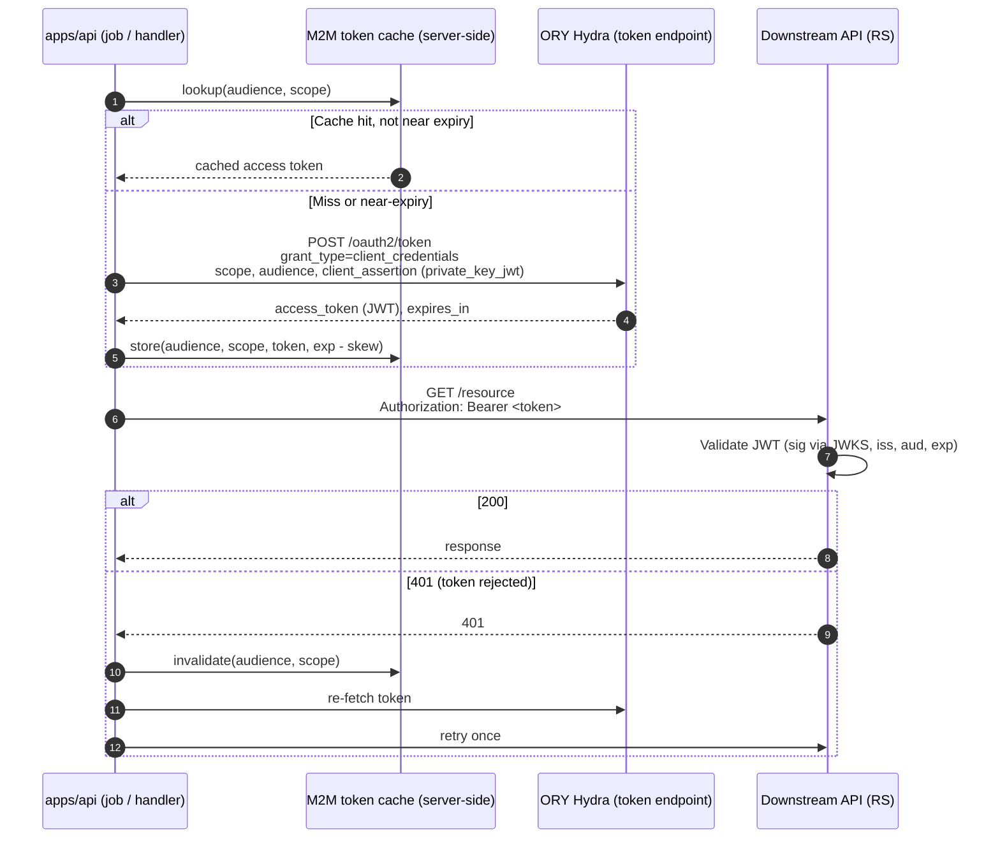

# Flow: M2M outbound calls (`client_credentials`)

Status: Draft
Last updated: 2026-05-12
Scope: `apps/api` acting as a confidential OAuth client to obtain access tokens for outbound, server-to-server calls when **no end user is in scope**.

References:
- [RFC 6749 §4.4](https://www.rfc-editor.org/rfc/rfc6749#section-4.4) — Client Credentials grant
- [RFC 7523](https://www.rfc-editor.org/rfc/rfc7523) — JWT Bearer client assertion (for `private_key_jwt`)
- [system-overview.md](../00-architecture/system-overview.md), [glossary.md](../glossary.md)
- [tokens-claims-audiences.md](../30-cross-cutting/tokens-claims-audiences.md)

## Purpose

Pin down how `apps/api` calls downstream APIs **as itself**: background jobs, scheduled work, system-initiated webhooks. This is one of the two non-interactive grants the three-grant rule ([OV-04](../00-architecture/system-overview.md#ov-04)..[OV-07](../00-architecture/system-overview.md#ov-07)) requires to stay separate from interactive login and token exchange.

## Out of scope

- User-context downstream calls. Those use RFC 8693 token exchange ([token-exchange-rfc8693.md](./token-exchange-rfc8693.md)), **not** `client_credentials`.
- Inbound auth at `apps/api` itself (covered by Resource Server requirements).
- Specific downstream API contracts.

## Sequence



## Requirements

### Client identity and credentials

- <a id="m2m-01"></a>**M2M-01.** `apps/api` **MUST** use a Hydra OAuth client registered **exclusively** for M2M `client_credentials`. This client **MUST NOT** be reused for interactive RP login or RFC 8693 token exchange ([OV-04](../00-architecture/system-overview.md#ov-04)).
- <a id="m2m-02"></a>**M2M-02.** Client authentication **SHOULD** use `private_key_jwt` (asymmetric client assertion per RFC 7523). `client_secret_basic` **MAY** be used in development environments only; production deployments **MUST** disable shared-secret authentication for this client.
- <a id="m2m-03"></a>**M2M-03.** Client private keys (or shared secrets in dev) **MUST** be stored only on `apps/api`. They **MUST NOT** appear in `apps/web` bundles, browser-reachable configuration, or version-controlled files.

### Token request shape

- <a id="m2m-04"></a>**M2M-04.** The request **MUST** target `token_endpoint` from discovery ([OV-01](../00-architecture/system-overview.md#ov-01)) with `grant_type=client_credentials`.
- <a id="m2m-05"></a>**M2M-05.** Every request **MUST** include the `audience` parameter set to the identifier of the downstream API being called. Wildcard or multi-audience tokens **MUST NOT** be requested ([OV-06](../00-architecture/system-overview.md#ov-06)).
- <a id="m2m-06"></a>**M2M-06.** `scope` **MUST** be the least-privilege scope required for the call. The set of allowed scopes per audience is declared in `apps/api` configuration and reviewed in code review.
- <a id="m2m-07"></a>**M2M-07.** M2M token requests **MUST NOT** include any user identifier (no `subject`, no `act`, no `sub` overrides). If the call needs user context, switch to token exchange — refer to [token-exchange-rfc8693.md](./token-exchange-rfc8693.md) and [OV-07](../00-architecture/system-overview.md#ov-07).

### Caching and lifecycle

- <a id="m2m-08"></a>**M2M-08.** Issued tokens **MUST** be cached server-side, keyed by `(client_id, audience, scope)`. The cache **MUST** be distinct from user-session token storage and from exchanged-token storage ([OV-05](../00-architecture/system-overview.md#ov-05)).
- <a id="m2m-09"></a>**M2M-09.** Cache TTL **MUST** be at most `expires_in - safety_skew` where `safety_skew ≥ 60s`. Tokens **MUST NOT** be reused past their `exp`.
- <a id="m2m-10"></a>**M2M-10.** Concurrent token requests for the same key **SHOULD** be coalesced (single-flight) so a thundering herd of jobs produces at most one token-endpoint call per (audience, scope).
- <a id="m2m-11"></a>**M2M-11.** On a downstream `401` indicating token rejection, `apps/api` **MUST** invalidate the cached entry and retry the call **once** with a freshly issued token. Further `401`s **MUST** surface as application errors; they **MUST NOT** trigger unbounded retry.

## Interfaces

### Outbound request

```http
POST {token_endpoint}
Content-Type: application/x-www-form-urlencoded

grant_type=client_credentials
&audience={downstream-api-id}
&scope={least-privilege-scope}
&client_assertion_type=urn:ietf:params:oauth:client-assertion-type:jwt-bearer
&client_assertion={signed-jwt}
```

Form-encoded values shown unencoded for clarity.

### Configuration in `apps/api`

| Setting | Purpose | Required |
| ------- | ------- | -------- |
| `OAUTH_M2M_CLIENT_ID` | Hydra OAuth client id for M2M only | yes |
| `OAUTH_M2M_PRIVATE_KEY` (or `_SECRET`) | Signing key for `private_key_jwt` (or secret for `client_secret_basic` in dev) | yes |
| `OAUTH_M2M_AUDIENCES` | Map of downstream API name → audience identifier | yes |
| `OAUTH_M2M_SCOPES` | Map of downstream API name → allowed scope set | yes |

Names are placeholders; exact env-var names are TBD at scaffolding time.

## Acceptance criteria

- [ ] A background job with no user context successfully calls a downstream API; the access token's `aud` equals the configured downstream audience and `client_id` equals the M2M client id. (M2M-01, M2M-04, M2M-05)
- [ ] The downstream API rejects (`401`/`403`) a token whose `aud` does not match its own identifier. (M2M-05, [OV-06](../00-architecture/system-overview.md#ov-06))
- [ ] A static scan or test confirms the M2M client id is **not** referenced in `apps/web` or any browser-shipped configuration. (M2M-03)
- [ ] Under 100 concurrent calls needing the same (audience, scope), at most one token-endpoint call is made. (M2M-10)
- [ ] Forcing the cache to expire causes exactly one new token request, after which subsequent calls reuse it. (M2M-08, M2M-09)
- [ ] A token rejected by the downstream is refetched and retried at most once; a second rejection raises an application error rather than looping. (M2M-11)
- [ ] M2M tokens are never present in any user-session record, in any HTTP response body to `apps/web`, or in any cookie. (M2M-08, [OV-08](../00-architecture/system-overview.md#ov-08))

## Open questions

- Whether the M2M client's `audience` is enforced **server-side at Hydra** (allowed audience whitelist on the client registration) or only requested by `apps/api`. Production-likeness favours Hydra-side enforcement.
- Whether `client_secret_basic` is allowed at all, even in dev, or whether the playground commits to `private_key_jwt` end-to-end. Default candidate: dev allowed, prod-equivalent disabled.
- How JWKS key rotation for the client-assertion signing key is handled (separate spec under `30-cross-cutting/discovery-and-jwks.md`).
